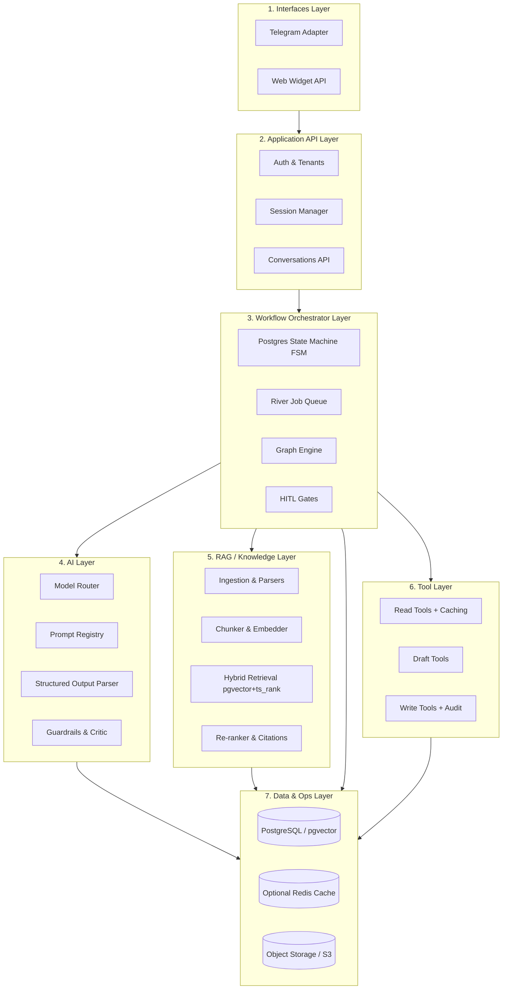
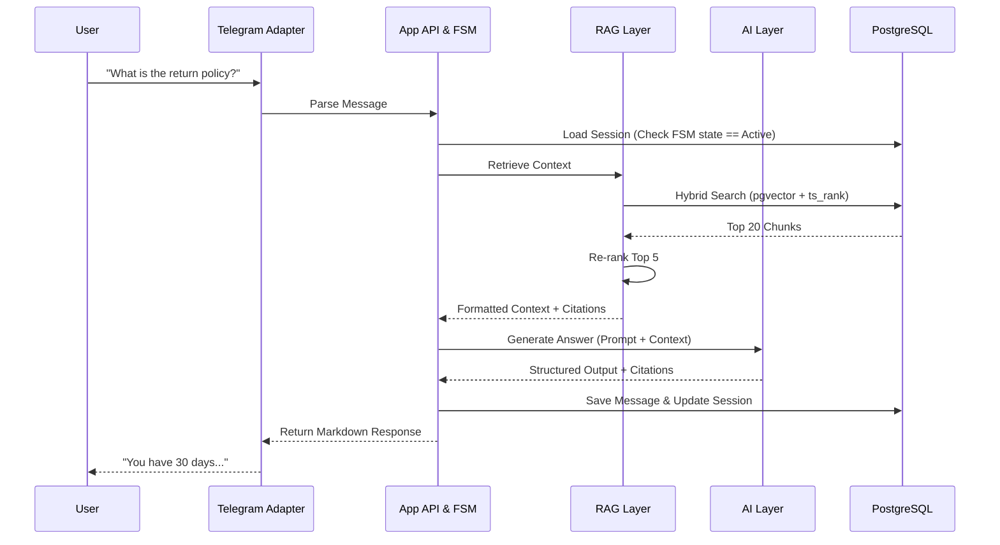
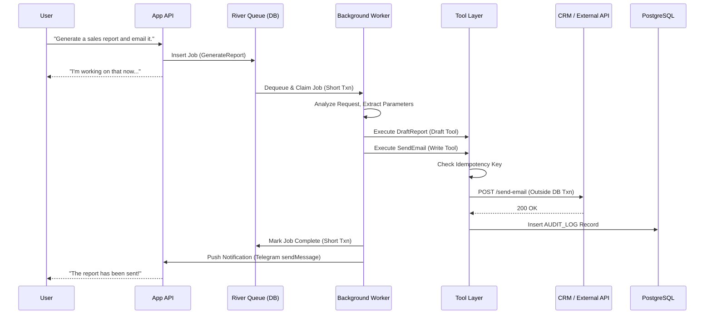
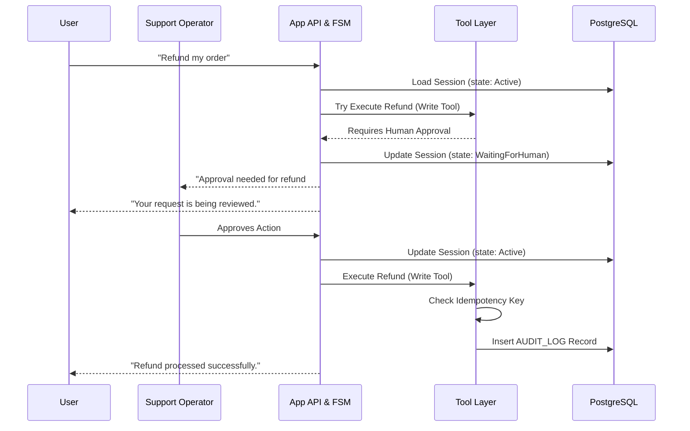
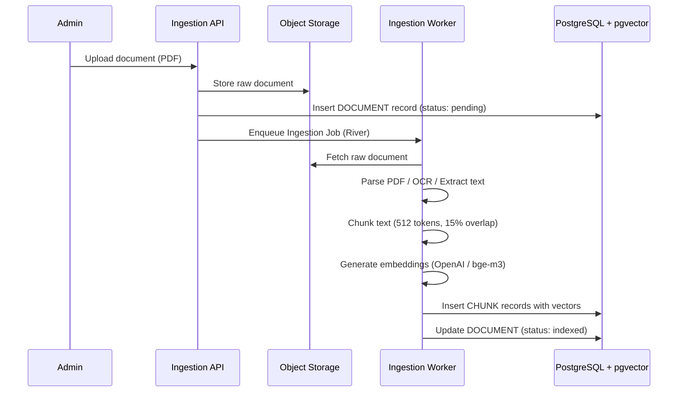
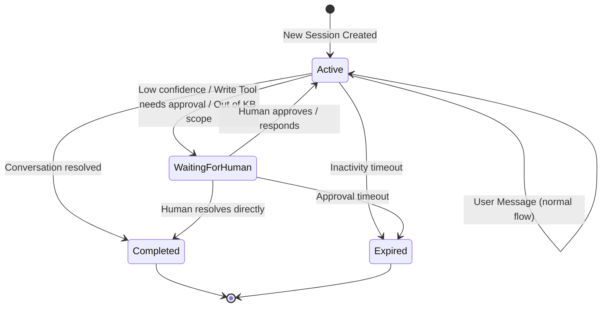
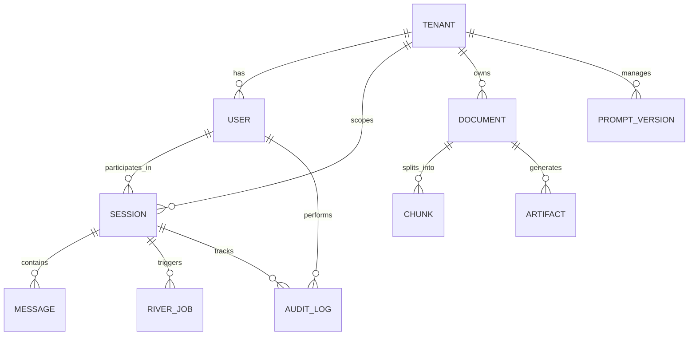

# Technical Requirements & Constraints

This document defines the functional and non-functional requirements that guide the development of the Ragivka framework. Every requirement is traceable to a finding or case study.

## 1. Non-Functional Constraints

### 1.1 Performance & Concurrency
*   **NFR-1 Low Latency (L0/L1):** Synchronous RAG requests must complete within webhook timeout limits (< 10 seconds). L2/L3 jobs are asynchronous and have no sync latency constraint.
*   **NFR-2 Concurrency:** The system must handle high concurrent loads (300+ req/min per tenant) using Go goroutines without memory bloat.
*   **NFR-3 Connection Pooling:** PostgreSQL connections must be pooled via `pgxpool` to prevent exhaustion during worker spikes.
*   **NFR-20 Rate Limiting:** The API and Channel Adapters must enforce per-tenant rate limits with configurable thresholds to prevent abuse.

### 1.2 Durability & Reliability
*   **NFR-4 Idempotency:** All Write Tool operations (generating PDFs, CRM webhooks, billing triggers, cart modifications) must be idempotent via unique operation keys (refs: Case Studies 2, 4, 6).
*   **NFR-5 Job Processing:** Background jobs (River) must support exponential backoff, configurable retry limits, and dead-letter queues, providing at-least-once delivery.
*   **NFR-6 State Persistence:** FSM transitions must be handled within a PostgreSQL transaction. Redis is strictly for ephemeral caching and rate limiting — never for durable state.
*   **NFR-7 Transaction Boundaries:** Database transactions must NOT be held open during external API calls. Claim job (short txn) → execute work → complete job (short txn).
*   **NFR-22 Backup/Recovery:** The PostgreSQL database must support continuous archiving for point-in-time recovery (PITR).
*   **NFR-24 Disaster Recovery:** The system must support an RTO of < 4 hours and RPO of < 1 hour in the event of a catastrophic database failure.

### 1.3 Extensibility & Deployment
*   **NFR-8 Pluggable LLMs:** Support for OpenAI, Anthropic, OpenRouter, Gemini, and local offline modes via Ollama. The Model Router interface must allow swapping providers without altering business logic.
*   **NFR-9 Deployment Modes:** The framework must support: (a) single-binary local deployment, (b) Docker Compose for development, (c) separate API/Worker binaries for horizontal scaling. Offline mode (Ollama + local embeddings) must be a first-class deployment target (ref: Case Study 5).
*   **NFR-10 Tool Registry:** Tools must be dynamically registerable (MCP-compatible transport) and enforce strict permission schemas (Read / Draft / Write).
*   **NFR-21 Error Standardization:** The REST API must return structured, standardized error responses (e.g., standard JSON with `code`, `message`, `details`) to clients.

### 1.4 Observability & Evaluation
*   **NFR-11 Tracing:** Every request must generate an OpenTelemetry distributed trace spanning the API boundary, database queries, and LLM API calls.
*   **NFR-12 Metrics:** Prometheus metrics must track: LLM token usage (prompt/completion), retrieval latency (p50/p95), River queue depth, and error rates.
*   **NFR-13 Cost Tracking:** Per-request token cost must be logged, enabling per-tenant cost attribution and budget enforcement.
*   **NFR-14 Quality Gates:** The system must track Retrieval Recall@K, Citation Coverage, and provide hooks for groundedness tests. In v1, these are strictly offline evaluation/logging hooks. Runtime blocking (rejecting/regenerating based on critic mismatches) is deferred to v2/L3.
*   **NFR-15 Audit Logging:** All Write Tool executions and FSM state transitions must be persistently logged in the `AUDIT_LOG` table with `idempotency_key`, tool name, and request/response hash.

### 1.5 Security & Multi-Tenancy
*   **NFR-16 Tenant Isolation:** All database queries and vector searches must be strictly tenant-scoped via `tenant_id` metadata filtering.
*   **NFR-17 Prompt Injection Defense:** User input must pass through a validation layer before being interpolated into prompts or tool arguments. For tools, the defense is the Read/Draft/Write permission boundary combined with strict JSON-schema output parsing.
*   **NFR-18 Data Privacy:** PII stripping hooks must be available in the ingestion pipeline before data reaches external LLM providers. Raw ingested documents in Object Storage must remain unmodified for traceability. For offline deployments using Ollama, PII never leaves the local machine.
*   **NFR-23 API Authentication:** The API must enforce strict authorization via short-lived JWT tokens or tenant-scoped API keys for all endpoints.

### 1.6 Internationalization
*   **NFR-19 Multilingual:** The framework must support multilingual knowledge bases and conversations (Ukrainian, Russian, English at minimum). Embedding models must handle Cyrillic text effectively (ref: Case Studies 3, 4).

## 2. Functional Requirements

### 2.1 Orchestration Tiers
*   **FR-1 L0 (Deterministic):** Single LLM call for summarization or extraction. No state machine required.
*   **FR-2 L1 (Tool Assistant):** Synchronous workflow with RAG retrieval, Function Calling to external APIs, and HITL escalation.
*   **FR-3 L2 (Workflow Pipeline):** Durable, multi-step asynchronous jobs via River (e.g., Ingest → Retrieve → Calculate → Generate PDF → Email).
*   **FR-4 L3 (Multi-Agent Graph):** DAG orchestration with Critic/Reviewer nodes, deadlock detection, and configurable timeouts per node.

### 2.2 State Machine (Session Management)
*   **FR-5 FSM States:** Four canonical states: `Active`, `WaitingForHuman`, `Completed`, `Expired`.
*   **FR-6 Optimistic Locking:** Session updates must use a `version` column to prevent race conditions from concurrent messages.
*   **FR-7 Session Expiry:** Sessions must auto-transition to `Expired` after a configurable inactivity timeout.
*   **FR-23 Conversation History Limits:** The session manager must enforce a context window retention policy (e.g., keeping only the last N turns or summarizing older messages) to prevent exceeding LLM token limits.

### 2.3 Knowledge & RAG Pipeline
*   **FR-8 Ingestion Lifecycle:** Connectors ingest raw documents (PDF, URL, DB rows) into Object Storage. Parsers (including OCR for scanned PDFs) normalize text. The pipeline supports document versioning, re-ingestion, and stale chunk cleanup.
*   **FR-9 Chunking:** Configurable semantic chunking (default: 512 tokens, 15% overlap). Chunks retain metadata: `document_id`, ordinal position, and source location for citation linking.
*   **FR-10 Hybrid Search:** Retrieval must combine `pgvector` HNSW similarity search with `tsvector`-based full-text keyword search (using `ts_rank`). Results are merged and deduplicated before re-ranking.
*   **FR-11 Re-ranking:** A cross-encoder re-ranker (e.g., Cohere Rerank or local BGE reranker) must re-order the top K results to maximize precision before feeding context to the LLM.
*   **FR-12 Citations:** Every RAG-grounded answer must include traceable citations linking back to specific source chunks. The citation format must include document name and chunk ordinal.

### 2.4 AI Layer
*   **FR-13 Model Router:** Routes requests to the appropriate LLM based on task complexity and cost policy. Cheap models (GPT-4o-mini, Haiku) for classification/extraction; expensive models (Sonnet, GPT-4o) for complex reasoning. Must support fallback on provider failure.
*   **FR-14 Prompt Registry:** Version-controlled storage for system prompts in PostgreSQL. Prompts are loaded by name+version, preventing drift between deployments.
*   **FR-15 Structured Output:** The LLM must be constrained to return strict JSON matching Go struct definitions. This enables deterministic downstream processing (artifact generation, tool arguments).
### 2.5 Tool Layer
*   **FR-16 Function Calling:** The LLM must be able to invoke registered Read, Draft, and Write Tools mid-conversation based on policy to fetch data, prepare actions, or mutate state (e.g., querying PrestaShop for price, or updating a cart).
*   **FR-17 HITL Gates:** The system must transition the FSM to `WaitingForHuman` (FR-5) and notify an operator when: (a) a Write Tool requires explicit human approval, or (b) the LLM expresses low confidence or detects an out-of-knowledge-base query (customer support escalation).
*   **FR-18 Tool Caching:** Read Tools calling slow or rate-limited external APIs must support configurable response caching with TTL to avoid overloading external systems.

### 2.6 Deterministic Artifact Generation
*   **FR-19 Separation of Concerns:** LLM output is used for structured data extraction (JSON). Actual file generation (PDF, Excel) is handled deterministically by Go libraries (`excelize`, HTML-to-PDF converters). The LLM never directly produces binary file content.
*   **FR-20 Object Storage:** Generated artifacts and raw ingested documents must be stored in S3-compatible object storage, referenced by the `DOCUMENT` and `ARTIFACT` tables in PostgreSQL.

### 2.7 Channel Adapters
*   **FR-21 Telegram Adapter:** Webhook-based integration via `gotgbot`. Must handle message parsing, Markdown/HTML response formatting, and inline keyboard interactions.
*   **FR-22 Web Widget API:** REST + WebSocket endpoints for embedding a chat UI on client websites. Must support tenant-scoped API key authentication.
*   **FR-24 Rate Limiting Strategy:** The system must enforce API rate limits (NFR-20) using a Redis-backed sliding window algorithm to ensure fairness and prevent tenant abuse.
# Core Concepts for AI Assistant & RAG Projects (Ragivka Framework)

Based on industry best practices, deep architectural reviews, and analysis of 10 freelance project briefs, here is the distilled blueprint of the Ragivka framework. Ragivka is designed as a **Session-backed workflow and RAG framework**, scalable from simple Q&A bots to complex multi-agent ecosystems.

## 1. Orchestration Levels (Tiered Complexity) (FR-1 to FR-4)

Not every project requires a complex multi-agent swarm. Most freelance projects ($600–$9,000) need L0 or L1. Ragivka supports progressive orchestration:

*   **L0 (Deterministic):** Single LLM call for summarization or extraction. No state machine needed. Example: Knowledge Assistant summarizer.
*   **L1 (Tool Assistant):** Synchronous RAG + Function Calling to external APIs + human escalation. Example: Customer support bot, e-commerce sales agent.
*   **L2 (Workflow Pipeline):** Durable, multi-step asynchronous jobs. Example: Payment → Calculate → Generate PDF → Email delivery. Also: document registry analysis pipelines.
*   **L3 (Multi-Agent Graph):** Full DAG execution with Critic/Reviewer loops. Reserved for complex, dynamic tasks like multi-source marketing research. Most projects do NOT need this tier.

## 2. Session & State Management (FR-5, FR-6, FR-7, FR-23, NFR-4, NFR-5, NFR-6, NFR-7)

*   **Session as a First-Class Citizen:** Managing context via strict Finite State Machines (FSM). Four canonical states: `Active`, `WaitingForHuman`, `Completed`, `Expired`. This prevents "Subject Drift" and context poisoning (a pattern validated across multiple investigation files). Conversation history retention is strictly managed via sliding context windows.
*   **Database-Backed Workflow:** We use **River** (PostgreSQL-backed job queue) for all durable async work. This ensures at-least-once delivery with idempotent handlers. If a server crashes, the workflow resumes where it left off. Redis is optional and cache-only.

## 3. RAG & Ingestion Pipeline (FR-8 to FR-12)

A robust RAG system requires a formal ingestion pipeline:

*   **Ingestion:** `Connector → Object Storage (raw) → Parser/OCR → Normalizer → Chunker (512 tokens, 15% overlap) → Embedder → pgvector Indexer`.
*   **Retrieval:** **PostgreSQL + pgvector** is the v1 default. The retrieval interface is designed for future pluggability (Qdrant, Milvus), but these are out of scope for v1.
*   **Hybrid Search:** Combining `pgvector` semantic similarity with `tsvector`/BM25 keyword matching. Essential for domains with exact terminology (legal terms, product SKUs, ISBNs).
*   **Re-ranking:** A cross-encoder re-ranker re-orders the top K results to maximize precision before passing context to the LLM.
*   **Citations:** Every RAG-grounded answer must cite specific source chunks. In legal/medical domains, a disclaimer is required: "human expert verification needed."

## 4. Function Calling & Tool Safety (FR-16, FR-17, FR-18, NFR-10)

*   **Function Calling:** The LLM can invoke registered Read Tools mid-conversation to fetch real-time data. The AI must NOT fabricate product prices, stock levels, or order statuses — it must call the actual API first (validated by the PrestaShop and CRM case studies).
*   **Tool Safety Boundaries:** Tools are strictly categorized:
    *   **Read** — Safe, read-only API queries (e.g., check CRM order status, search product catalog).
    *   **Draft** — Prepare an action without committing (e.g., draft an email, preview a report).
    *   **Write** — State-mutating actions (charge a card, update a DB, send an email). These require idempotency keys, audit logging, and optionally human confirmation via HITL Gates.
*   **Tool Caching:** Read Tools calling slow external APIs (e.g., PrestaShop 1.6) must cache responses with configurable TTL.

## 5. Observability, Audit & Evaluation (FR-19, NFR-11 to NFR-15)

We do not claim to "completely eliminate" hallucinations from LLM output. Instead, we implement defense-in-depth to *reduce and detect* unsupported claims:

*   **Self-RAG & Critic Patterns:** A Critic/Reviewer step evaluates the generated answer against retrieved chunks. In v1, this acts purely as a logging/evaluation hook (flagging mismatches in analytics). Runtime blocking (rejecting/regenerating) is reserved for L3/v2.
*   **Deterministic Outputs:** For artifact generation (PDF, Excel), business calculations, and statistical aggregations, the LLM extracts structured JSON. Actual file generation and calculations are handled by deterministic Go code (e.g., `excelize`), ensuring template validity.
*   **Observability & Audit:** OpenTelemetry tracing for every request, Prometheus metrics, per-request token cost tracking. All state-mutating actions generate immutable records in the `AUDIT_LOG`.
*   **Agent Timeouts:** Explicit deadlock detection and configurable timeouts for L3 Critic/Generator loops.
# Comprehensive Architecture Description (Ragivka Framework)

This document provides a deep dive into the Ragivka architecture, detailing every component, its responsibilities, interactions, and the underlying data models.

## 1. High-Level Layered Architecture

Ragivka is organized into seven distinct, decoupled layers.



## 2. Component Descriptions

### 2.1 Interfaces Layer (FR-21, FR-22)

The entry points into the framework.

*   **Telegram Adapter:** Webhook-based integration via `gotgbot`. Handles message parsing, Markdown/HTML response formatting, and inline keyboard interactions. This is the primary channel for v1 (8 of 10 investigated projects use Telegram).
*   **Web Widget API:** REST + WebSocket endpoints for embedding a chat UI on client websites. Authentication via tenant-scoped API keys. The widget is loaded as an external script that doesn't impact site loading speed.

### 2.2 Application API Layer

Handles business logic boundaries and access control.

*   **Auth & Tenants (NFR-16):** Ensures every request is mapped to a specific tenant. Validates API keys. All downstream queries inherit the `tenant_id` filter.
*   **Session Manager (FR-5, FR-6, FR-7):** Manages the lifecycle of user conversations. Creates new sessions, resumes existing ones, and auto-expires inactive sessions via a configurable timeout.
*   **Conversations API:** CRUD operations for chat histories. Messages are stored in PostgreSQL with `role` (user/assistant/system), content, citation references, and token counts. Strictly tenant-isolated.

### 2.3 Workflow Orchestrator Layer

The heart of Ragivka, responsible for reliable execution.

*   **Postgres State Machine / FSM (FR-5, NFR-6):** Tracks conversation states (`Active`, `WaitingForHuman`, `Completed`, `Expired`). Uses optimistic locking (`version` column) to prevent race conditions from concurrent messages.
*   **River Job Queue (NFR-5, NFR-7):** The asynchronous engine. Handles long-running L2/L3 tasks using PostgreSQL transactions to guarantee at-least-once delivery, exponential backoffs, and dead-letter queues. External API calls are always made OUTSIDE the River transaction to prevent connection pool exhaustion.
*   **Graph Engine (FR-4):** A lightweight DAG engine used only for L3 tasks (e.g., routing work between a Researcher, Critic, and Writer). Includes configurable per-node timeouts and deadlock detection for Critic/Generator loops.
*   **HITL Gates (FR-17):** Pauses execution and transitions the FSM to `WaitingForHuman` when: (a) confidence is low, (b) a Write Tool requires human approval, or (c) the query falls outside the knowledge base scope. Notifications are sent to the designated operator via Telegram message or webhook callback.

### 2.4 AI Layer

Abstracts away the underlying LLM providers.

*   **Model Router (FR-13, NFR-8):** Dynamically routes requests based on task complexity and cost policy. Cheap models (GPT-4o-mini, Haiku) for intent classification and extraction; expensive models (Sonnet, GPT-4o, DeepSeek-R1) for complex reasoning. Supports automatic fallback on provider failure.
*   **Prompt Registry (FR-14):** Version-controlled storage for system prompts in PostgreSQL. Prompts are loaded by name + version, preventing drift between deployments. Changes to prompts are tracked for audit.
*   **Structured Output Parser (FR-15):** Forces LLMs to return strict JSON matching Go struct definitions via JSON-schema constraints or function-calling mode. This enables deterministic downstream processing.
*   **Guardrails & Critic (NFR-14):** Evaluates LLM outputs for hallucination. Cross-references generated answers against RAG-retrieved chunks. In v1, this acts as an evaluation hook (tracking Citation Coverage and Retrieval Recall@K). Runtime blocking (regenerating or flagging for human review) is deferred to v2/L3.

### 2.5 RAG / Knowledge Layer

The ingestion and retrieval engine.

*   **Ingestion & Parsers (FR-8):** Connectors fetch raw data (PDFs, URLs, DB rows) and store originals in Object Storage. Parsers (including OCR for scanned engineering PDFs with tables and diagrams) normalize text. Supports document versioning, re-ingestion on source change, and stale chunk cleanup.
*   **Chunker & Embedder (FR-9):** Splits text (default: 512 tokens, 15% overlap) and generates vectors via OpenAI, Cohere, or local bge-m3 (Ollama). Chunks retain metadata: `document_id`, ordinal position, and source location for citation linking. Embedding model must handle Cyrillic text (NFR-19).
*   **Hybrid Retrieval (FR-10):** Executes queries against PostgreSQL using both `pgvector` HNSW index (semantic similarity) and `tsvector` GIN index (ts_rank keyword matching). Results are merged and deduplicated. Essential for domains with exact terminology (legal terms, ISBNs, product SKUs).
*   **Re-ranker & Citations (FR-11, FR-12):** A cross-encoder re-ranker (Cohere Rerank or local BGE reranker) re-orders the top K results to maximize precision. Every answer includes traceable citations linking back to specific source chunks with document name and chunk ordinal.

### 2.6 Tool Layer (FR-16, FR-17, FR-18, NFR-10)

Provides the AI with deterministic, permissioned actions via a Tool Registry (MCP-compatible transport).

*   **Read Tools + Caching:** Safe, read-only API calls (e.g., query PrestaShop for product price, check CRM for order status). Responses from slow or rate-limited external APIs are cached with configurable TTL to avoid overloading legacy systems.
*   **Draft Tools:** Safe actions that prepare execution without committing (e.g., draft an email, preview a report, prepare a cart summary).
*   **Write Tools + Audit:** State-mutating actions (e.g., charge a card, create a CRM lead, add to shopping cart, send an email). These MUST implement idempotency keys and generate persistent records in the `AUDIT_LOG` table. Write Tools marked as requiring approval trigger the HITL gate flow.

### 2.7 Data Layer

The absolute source of truth.

*   **PostgreSQL (NFR-3):** Stores everything: Tenants, Users, Sessions, Messages, River Jobs, Prompts, Vectors (via `pgvector`), and Audit Logs. This ensures atomic backups and transactional consistency across the entire framework.
*   **Optional Redis Cache (NFR-6):** Used *only* for ephemeral data: rate limiting, fast session-lock checking, and caching expensive embedding lookups. Never used for durable state.
*   **Object Storage / S3 (FR-20):** Stores raw uploaded documents (pre-parsing), generated PDF/Excel artifacts, and other binary outputs. Referenced by `document_id` and `artifact_id` in PostgreSQL.

---

## 3. Interaction Lifecycles (Data Flow)

### Scenario A: Synchronous RAG Request (L1)

Used for fast, simple Q&A. Must complete within webhook timeout limits (< 10s). Validates Case Studies 1, 3, 4.



### Scenario B: Asynchronous Job with Write Tool (L2)

Used for durable multi-step pipelines. External API calls are made OUTSIDE the database transaction (NFR-7). Validates Case Studies 2, 5, 6.



### Scenario C: Human-in-the-Loop Write Approval (HITL)

Used when a Write Tool requires explicit human authorization. Validates Case Studies 3, 4. Maps to FR-17.



### Scenario D: Document Ingestion Pipeline

Used to populate the knowledge base. Validates Case Studies 1, 5, 6. Maps to FR-8, FR-9.



---

## 4. FSM State Transition Diagram



---

## 5. Core Data Model Relations

The PostgreSQL database acts as the central nervous system. All entities are strictly isolated by `tenant_id`.



*   **TENANT:** The absolute security boundary. Every downstream table includes a `tenant_id` foreign key.
*   **USER:** An end-user interacting via a Channel. Contains `channel_type` (telegram/web) and `channel_id` (e.g., Telegram user ID).
*   **SESSION:** The FSM container. Contains `state` enum, `version` (optimistic locking), `orchestration_tier` (L0–L3), `channel`, and `expires_at`.
*   **MESSAGE:** Individual chat turns. Contains `role` (user/assistant/system), `content`, `citation_refs[]`, `token_count`, and optional `job_id` for async replies.
*   **RIVER_JOB:** Tracks async tasks. Links to a Session via `session_id` and includes `tenant_id`, `idempotency_key`, `payload` (JSONB), and `attempt` count.
*   **AUDIT_LOG:** Immutable ledger recording every Write Tool execution. Contains `tool_name`, `idempotency_key`, request/response hash, and optional `approval_record` for HITL actions.
*   **DOCUMENT:** A raw file uploaded to the Knowledge Layer. Contains S3 key, `version`, `ingestion_status` (pending/indexed/stale), and `tenant_id`.
*   **CHUNK:** Text segments belonging to a Document. Contains `document_id`, ordinal position, `content`, `vector` (pgvector), `tsvector` (BM25), and metadata for hybrid search filtering.
*   **PROMPT_VERSION:** Version-controlled system prompts. Contains `name`, `version`, `content`, and `created_at`.
*   **ARTIFACT:** Generated output files (PDF, Excel). Contains `session_id`, S3 key, `type`, and `created_at`.

## 6. Security and Boundaries

*   **Tenant Isolation (NFR-16):** All database queries are filtered by `tenant_id` at the repository layer. Vector searches apply `tenant_id` metadata filtering. Cross-tenant data leakage is architecturally impossible.
*   **Prompt Injection Defense (NFR-17):** User input passes through strict JSON-schema validation before being interpolated into tool arguments. The Read/Draft/Write permission boundary ensures the LLM cannot invoke dangerous tools without explicit registration.
*   **PII Handling (NFR-18):** PII stripping hooks are available in the ingestion pipeline. For offline deployments using Ollama, data never leaves the local machine.
*   **Error Propagation (NFR-5):** If a River job fails, it retries with exponential backoff. After exhausting retries, it moves to a dead-letter queue for manual inspection. Errors are logged with the full OpenTelemetry trace ID.
*   **Deployment View (NFR-9):** Designed as a statically compiled single Go binary. In small deployments, the API server and River workers run in the same process. In high-scale deployments, the binary runs in "API Mode" or "Worker Mode" for independent horizontal scaling. Offline mode uses Ollama for LLM + bge-m3 for embeddings.

## 7. Package Structure

```text
ragivka/
├── cmd/
│   ├── server/           # API server entrypoint
│   └── worker/           # River worker entrypoint
├── internal/
│   └── config/           # Viper-based configuration
├── pkg/
│   ├── runtime/          # Session FSM, River integration, HITL gates
│   ├── aicore/           # Model Router, Prompt Registry, Structured Output
│   ├── knowledge/        # Ingestion, chunking, pgvector retrieval, re-ranking
│   ├── channel/          # Telegram adapter, Web Widget API
│   ├── tools/            # Tool Registry (Read/Draft/Write), Function Calling, caching
│   ├── guardrails/       # Critic, citation validation, evaluation hooks
│   └── graph/            # Optional L3 DAG engine
└── docker-compose.yml    # PostgreSQL + pgvector (+ optional Redis)
```
