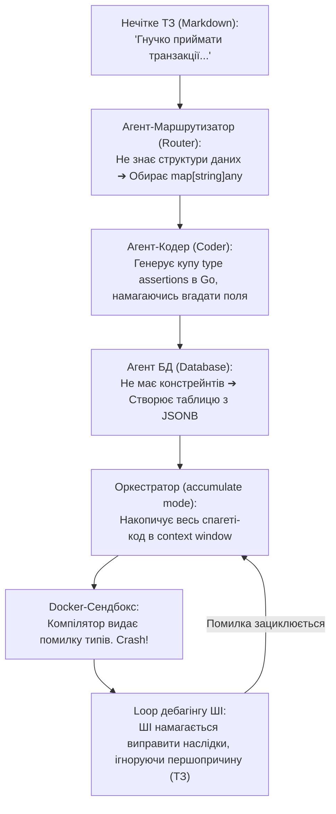

# Analлітичний звіт: Рецензія на план статті "Джерело Невідомості"

**Автор:** AI Systems Architect & Technical Content Strategist  
**Об'єкт аналізу:** [SourceOfTheUnknown-Plan.md](file:///home/val/wrk/promo/source_of_the_unknown/SourceOfTheUnknown-Plan.md)  
**Дата:** 3 липня 2026 року

---

## 🎯 Резюме (Executive Summary)

План статті **«Джерело Невідомості: Стохастична Інженерія та Вимірювання Точності в Еру ШІ-Агентів»** є надзвичайно актуальним, концептуальним та драйвовим маніфестом. Він б'є в одну з найболючіших точок сучасної розробки — неконтрольоване масштабування кодових баз автономними ШІ-агентами через нечіткість та розмитість вхідних бізнес-специфікацій.

Стаття вдало поєднує глибоку філософську концепцію («закон збереження вайбу», «хмара намірів») із практичним системним інжинірингом (ентропія специфікацій, Graph-RAG, Neo4j/RFLP, оптимізація Go-коду без алокацій у купі).

Цей звіт містить детальний аналіз сильних та слабких сторін поточного плану, а також пропонує конкретні покращення щодо математичного апарату, виправлення технічних помилок у Go-коді, додавання візуальних схем та практичних прикладів.

---

## 💪 Сильні сторони плану (Strengths)

1. **Оригінальність концепції та термінології**:
   Ідея трансформувати традиційне «Єдине джерело істини» (Single Source of Truth) на **«Джерело невідомості» (Source of Unknown)** є свіжою та потужною. Вона точно описує проблему, коли ШІ-агенти сприймають специфікацію не як детерміновану інструкцію, а як стохастичний розподіл ймовірностей, масштабуючи прихований у тексті хаос у 10 разів.
2. **Драматичний та захопливий наратив**:
   Поділ на Акти (від ілюзій детермінізму до реального колапсу й вирішення через оцифрування метрик та код) тримає високий темп оповідання. Це робить матеріал живим, драйвовим та незанудним.
3. **Точна відповідність цільовій аудиторії (Senior/Lead)**:
   Використання професійного сленгу та технологій (*AST-diff, Go sync.Pool, RFLP, Graph-RAG, Docker-сендбокси, zero-heap allocation*) створює відчуття глибокої технічної експертизи. Стаття розмовляє з досвідченими архітекторами їхньою мовою.
4. **Математизація "туману специфікацій"**:
   Введення конкретних метрик ($H_{spec}$, $D_{const}$, $K_{drift}$) переводить обговорення з суб'єктивного «хороше/погане ТЗ» у площину об'єктивних інженерних вимірювань. Особливо вдалою є метрика $K_{drift}$ (коефіцієнт реляційного дрейфу), яка математично виловлює «висячі» бізнес-вимоги без архітектурної деталізації.
5. **Наочний кейс-стаді (Act V)**:
   Приклад з руйнуванням типів (Go `map[string]any` ➔ type assertions ➔ PG JSONB ➔ Docker compilation crash) є надзвичайно життєвим та впізнаваним для практиків, що стикалися з автоматизацією агентів.

---

## ⚠️ Слабкі сторони та критичні білі плями (Weaknesses)

1. **Математичний люфт у метриці $H_{spec}$ (Specification Entropy)**:
   В описі метрики пропонується використовувати формулу Шеннона:
   $$H_{spec} = - \sum_{i=1}^{n} P(x_i) \log_2 P(x_i)$$
   При цьому стверджується, що результати 10 генерацій порівнюються через "AST-diff за формулою косинусної близькості векторів абстрактних синтаксичних дерев". 
   * **Проблема**: Косинусна близькість (cosine similarity) дає міру схожості між векторами, але сама по собі вона не визначає розподіл ймовірностей $P(x_i)$ для окремих станів $x_i$, необхідний для розрахунку формули Шеннона. Без пояснення, як саме попарні відстані AST-дерев групуються у класи еквівалентності (архітектурні стани), формула виглядає відірваною від реального алгоритму.

2. **Помилки та недоліки у Go-коді (Act V)**:
   * **Логічна помилка (Out of Bounds / Missing Marker)**:
     У рядку 169 плану написано:
     ```go
     if i+7 < len(rawBytes) && bytes.Equal(rawBytes[i:i+7], []byte("@schema")) {
     ```
     Якщо довжина `rawBytes` дорівнює точно 7 і файл містить лише `@schema`, то при `i=0` умова `0+7 < 7` поверне `false`. Маркер наприкінці файлу буде пропущено. Має бути `<=` замість `<`.
   * **Ризик Heap Escape**:
     Метод `env.Buffer.ReadFrom(r)` може призвести до алокації пам'яті в купі (heap escape). Якщо розмір специфікації перевищить початковий розмір буфера (256KB), внутрішній слайс `bytes.Buffer` розшириться за рахунок нової алокації в купі, що ламає концепцію *Zero-Heap Allocation*.
   * **Наївність реалізації**:
     Алгоритм заявляє, що він вимірює Truth Density, але насправді просто рахує пробіли та шукає підрядок `@schema`. Для глибокої архітектурної статті це виглядає занадто спрощено.
   * **Невикористані змінні**:
     Поле `TokenSlot []byte` у структурі `IngestionEnvironment` створюється, но не використовується.

3. **Прогалина в практичній реалізації Graph-RAG ($D_{const}$)**:
   Опис метрики синтаксичної щільності обмежень ($D_{const}$) посилається на Neo4j та концепт RFLP. Проте повністю випущено опис процесу: *як саме* Markdown перетворюється на структурований граф. Це створює відчуття «магічного кроку», який читач не зможе повторити.

---

## 🛠️ Що можна покращити (What could be improved)

1. **Синхронізувати математику $H_{spec}$**:
   Запропонувати простий алгоритм кластеризації:
   > Здійснюємо 10 генерацій коду за температури 1.0. Порівнюємо кожну пару згенерованих файлів через AST-diff та отримуємо матрицю відстаней. Групуємо результати у кластери (наприклад, якщо схожість > 0.95, вони належать до одного кластера $x_i$). Тоді $P(x_i) = \frac{\text{кількість елементів у кластері } i}{10}$.
   
   Це робить застосування ентропії Шеннона математично обґрунтованим.

2. **Рефакторинг Go-коді**:
   * Змінити умову перевірки слайсу:
     ```go
     if i+7 <= len(rawBytes) && bytes.Equal(rawBytes[i:i+7], []byte("@schema")) {
     ```
   * Запобігти heap escape за допомогою обмеження вхідного потоку (`io.LimitReader`) або додати коментар, що розмір специфікації обмежується константним лімітом пулу.
   * Використати або прибрати `TokenSlot`.
   * Додати коментар-дисклеймер, що цей код є спрощеною ілюстрацією пулінгу буферів для швидкого парсингу, а не повним синтаксичним аналізатором.

3. **Розкрити деталі побудови графа**:
   Пояснити, що для розкладання ТЗ на RFLP-граф використовується легкий проміжний AI-агент (Parser), який виділяє сутності за допомогою строго заданої JSON-схеми (Structured Outputs), або Markdown-лінтер, що реагує на спеціальну розмітку.

---

## ➕ Що варто додати (What should be added)

### 1. Візуалізація колапсу конвеєра (Mermaid Diagram)
Додавання візуальної схеми в **Act V** розвантажить текст та зробить архітектурний кейс-стаді миттєво зрозумілим.



### 2. Порівняльний приклад Markdown (Низька vs Висока точність)
Покажіть читачеві контраст між туманним ТЗ та ТЗ із високою Truth Density:

#### Поганий приклад (Низька точність / Висока ентропія):
```markdown
# Система обробки платежів
- Система повинна приймати транзакції від різних провайдерів.
- Необхідно логувати успішні та неуспішні результати.
```

#### Хороший приклад (Висока точність / Низька ентропія):
```markdown
# Система обробки платежів
@schema Transaction {
  id: UUID,
  amount: Decimal(10, 2) @constraint(min: 0.01),
  currency: String(3) @constraint(pattern: "^[A-Z]{3}$"),
  provider: String @constraint(in: ["Stripe", "PayPal"])
}

1. [REQ-PAY-01] Система повинна валідувати вхідний запит за схемою Transaction.
   -> [FUN-PAY-01] AcceptTransaction(tx Transaction)
2. [REQ-PAY-02] Всі результати мають логуватися в реляційну таблицю payment_logs.
   -> [FUN-PAY-02] Запис полів (tx_id, status, error_message)
```

### 3. Зв'язок метрик із поведінкою Оркестратора
Додати опис того, як саме метрики впливають на логіку виконання:
* **Fail-Safe зупинка**: Якщо $H_{spec} > 1.5$ або $D_{const} < 0.1$, оркестратор автоматично припиняє виконання та повертає ТЗ автору.
* **Динамічний Reasoning**: При низькій ентропії оркестратор знижує параметр `reasoning.effort` (економія токенів), оскільки завдання чітко затиснуте у рамки схем.

---

## 🔧 Запропоновані зміни в коді (Code Diff)

Пропонується внести такі зміни до Go-валідатора в плані статті:

```diff
-	// Алгоритм лінійного сканування байтового масиву без створення проміжних рядків (Slice Header Trap Avoidance) [6]
-	rawBytes := env.Buffer.Bytes()
-	for i := 0; i < len(rawBytes); i++ {
-		// Умовний маркер строгого інженерного констрейнту в нашому виконуваному Markdown (наприклад, '@schema')
-		if i+7 < len(rawBytes) && bytes.Equal(rawBytes[i:i+7], []byte("@schema")) {
-			metrics.StrictNodes++
-			i += 6
-			continue
-		}
+	// Алгоритм лінійного сканування байтового масиву без створення проміжних рядків (Slice Header Trap Avoidance) [6]
+	rawBytes := env.Buffer.Bytes()
+	for i := 0; i < len(rawBytes); i++ {
+		// Умовний маркер строгого інженерного констрейнту в нашому виконуваному Markdown (наприклад, '@schema')
+		// Використовуємо <= len(rawBytes) для запобігання пропуску маркера наприкінці файлу
+		if i+7 <= len(rawBytes) && bytes.Equal(rawBytes[i:i+7], []byte("@schema")) {
+			metrics.StrictNodes++
+			i += 6
+			continue
+		}
```

---

## 📈 Висновок

План статті має колосальний потенціал стати вірусним технічним матеріалом серед архітекторів та лід-інженерів. Усунення математичних неточностей, виправлення мікро-багів у коді на Go та додавання наочних схем перетворить цей план на бездоганну основу для публікації вищого ґатунку.
